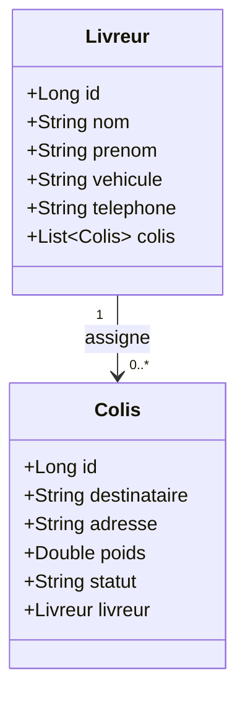

# Smart Delivery Management System

## Contexte du projet
La société **SmartLogi** souhaite moderniser et automatiser la gestion de ses livraisons afin d’améliorer la précision, la fiabilité et l’efficacité de ses opérations logistiques.

Actuellement, le suivi des colis et des livreurs se fait manuellement à l’aide de fichiers Excel et de registres papier, ce qui entraîne plusieurs problèmes :
- **Erreurs de saisie** : des informations incorrectes peuvent être enregistrées (adresse, poids, destinataire).
- **Retards dans les livraisons** : difficultés de planification et suivi en temps réel.
- **Double enregistrement ou perte de données** : certains colis peuvent être enregistrés plusieurs fois ou perdus.
- **Visibilité limitée** : difficultés à obtenir des rapports précis sur l’état des livraisons ou la charge de travail des livreurs.

Ce projet a pour objectif de créer un système centralisé permettant de :
- Gérer efficacement les informations sur les colis et les livreurs.
- Éviter les erreurs de saisie et les doublons.
- Améliorer la planification et la visibilité des livraisons.

---

## User Stories
Le système doit permettre au gestionnaire de :
1. **Gérer les livreurs (CRUD)** : centraliser toutes les informations, éviter les doublons et les erreurs de saisie.
2. **Enregistrer un colis et l’assigner à un livreur** : suivre chaque livraison et éviter les pertes ou enregistrements multiples.
3. **Mettre à jour le statut d’un colis** (`préparation`, `en transit`, `livré`) : assurer une visibilité en temps réel sur l’avancement des livraisons.
4. **Lister tous les colis assignés à un livreur** : planifier efficacement les tournées et réduire les retards.
5. **Supprimer ou corriger une information erronée** : garantir la fiabilité et l’intégrité des données.

---

## Exigences techniques
### Technologies utilisées
- **Spring Core** : IoC, DI, Beans, Scopes
- **Spring Data JPA** : persistance des entités
- **PostgreSQL** : base de données
- **Maven** : gestion de projet
- **Git / GitHub** : versioning
- **(Bonus) Spring MVC** : exposer les endpoints CRUD
- **(Bonus) Postman** : tester l’API

### Modèle de données
#### Entité Livreurs
- `id` : identifiant unique
- `nom`
- `prénom`
- `véhicule`
- `téléphone`

#### Entité Colis
- `id` : identifiant unique
- `destinataire`
- `adresse`
- `poids`
- `statut` : `préparation`, `en transit`, `livré`
- `idLivreur` : référence vers le livreur assigné

### Fonctionnalités
- CRUD pour **Livreur** et **Colis**
- Assignation des colis à un livreur
- Mise à jour du statut des colis
- Consultation des colis par livreur
- Gestion des erreurs et des doublons

---

## Dépendances Maven
- `spring-core`
- `spring-context`
- `spring-data-jpa`
- `postgresql`
- `hibernate-core`
- (Bonus) `spring-web`, `spring-boot-starter-web`

---

## Tests
- La logique métier est testée via une classe `Main.java` pour valider :
    - les opérations CRUD,
    - la relation entre livreurs et colis,
    - la gestion des doublons et erreurs.

---

## Diagramme de classes

## Bonus (optionnel)
- Exposition des opérations CRUD via **Spring MVC REST API**
- Test des endpoints avec **Postman** (format JSON)
- Authentification basique pour sécuriser les endpoints

---
